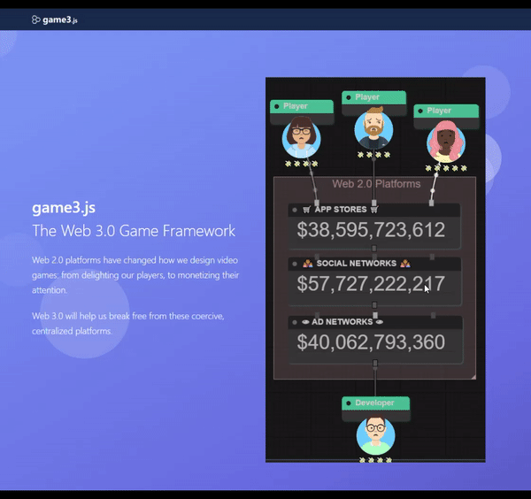

game3.js 
====
#### Javascript game framework for web 3.0

Introduction
----
**game3.js** allows you to decentralize games using web 3.0 technologies.

#### Getting Started
www.game3js.com

[overview]: (https://docs.google.com/drawings/d/1aUSMeocqC4oyyutpTRau8Zaz0Bd4oMRcr8css3sCgcM/edit?usp=sharing)
[overview-img]: (https://docs.google.com/drawings/d/e/2PACX-1vRzF6Ws2C2BXrQAIcSi-XWQLYrgxnEQ2-Z1xCdN2MERA12LAdxllNVqNmRh4xdBSq6LRx2KX4M-7vWW/pub?w=960&amp;h=720)